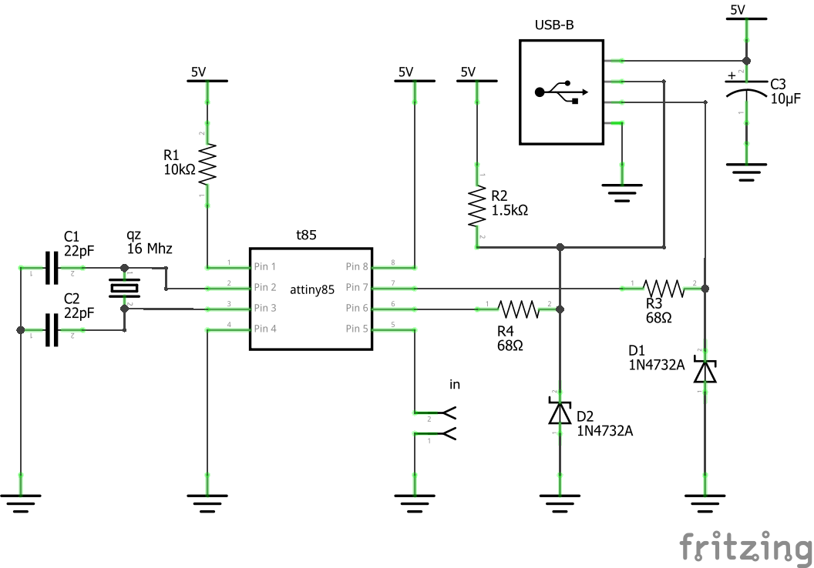

# MidiFoot
The MidiFoot is a USB MIDI controller with a single button. It sends hold pedal (CC#64) messages on MIDI channel 15, but with a rotating pattern of 16 values for each press and release so you can map the messages to different things. This allows it to be used as a momentary or toggle button, and even play 4, 8, or 16-note patterns. It uses an ATTiny85 to emulate a class-compliant USB MIDI device using the [V-USB](https://www.obdev.at/products/vusb/index.html) library, so it’s inexpensive and doesn’t need any drivers installed to work on most computers. The PID=1508 and VID=5824 have been generously provided by [Objective Development](https://www.obdev.at/). Much credit to [Martin Homuth-Rosemann](http://cryptomys.de/horo/index.html) for developing [V-USB-MIDI](http://cryptomys.de/horo/V-USB-MIDI/index.html), on which this is based. The MidiFoot is a creation of [Geek Funk Labs](http://geekfunklabs.com), where you can find a complete bill of materials, links to obtain kits/builds, etc.

The ranges of values to map for each function are shown in the list below.

- 16-step pattern (this is the full sequence):
  70, 0, 100, 30, 85, 15, 115, 45, 75, 5, 105, 35, 80, 10, 110, 40
- 8-step pattern:
  70-75, 0-5, 100-105, 30-35, 80-85, 10-15, 110-115, 40-45
- 4-step pattern:
  70-85, 0-15, 100-115, 30-45
- Toggle switch:
  - On: 70-85
  - Off: 100-115
- Momentary switch:
  - On: 64-127
  - Off: 0-63
  
## Schematic



## Installing/Flashing

You will need an AVR-C environment installed to build from source. A Raspberry Pi is quite useful as a build environment, as you can compile code and flash AVRs using the SPI interface on the GPIO header. The included Makefile assumes you are doing this - modify the `AVRDUDE` variable if you are using a different programmer. To install the necessary tools for compiling and flashing on the Pi, enter
```
sudo apt install gcc-avr avr-libc avrdude
```
Make the following connections to program the ATTiny85:

RPi Physical Pin | ATTiny85
-----------------|-----------
23 (SCLK)        | 7 (SCK)
21 (MISO)        | 6 (MISO)
19 (MOSI)        | 5 (MOSI)
22 (GPIO25)      | 1 (RESET)
2 (5V)           | 8 (VCC)
6 (GND)          | 4 (GND)

You must also connect a 16MHz clock source (quartz oscillator) to pins 2&3 (XTAL1&2) on the ATTiny, and ground each pin through a 22pF capacitor. To compile the software, flash the chip, and set the fuses, enter
```
sudo make flash && sudo make fuse
```
## Modifying
You can send whatever messages you wish by modifying the code in _midifoot.c_ and recompiling and flashing as described above. Modify the `midiPkt` array to change what messages are sent - the [comment](https://github.com/albedozero/midifoot/blob/f3f80baf9e75f18e045adbeb4e9365699b2baa4f/midifoot.c#L208) above the declaration explains the formatting of MIDI packets. If you change the total number of messages, update `MSG_COUNT` to reflect the new value.
